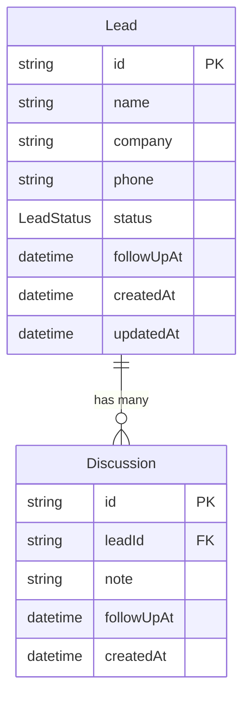

# LeadFlow CRM

A production-grade Lead Management (CRM) tool for sales reps. Single-screen interface with lead tracking, follow-up pinning, discussion timelines, and real-time UI updates.

---

## Features

- One-screen design — sidebar list + detail panel, no routing
- Smart pinning — leads with today's follow-up pinned to "Action Required"
- Overdue highlights — past follow-ups shown in red
- Rich timeline — vertical discussion history per lead with follow-up chips
- Instant search — debounced name search, no extra keypresses
- Status filter — filter by any lead status
- Optimistic updates — discussion notes appear instantly before server confirms
- Full Docker setup — three containers, postgres healthcheck, migrate + seed on start

---

## Tech Stack

| Layer | Choice |
|---|---|
| Runtime | Node.js 20 LTS |
| Framework | Express 4 |
| Database | PostgreSQL 16 |
| ORM | Prisma |
| Validation | Zod |
| Frontend | React 18 + Vite |
| UI Components | Radix UI primitives |
| State (UI) | Zustand |
| State (Server) | TanStack Query v5 |
| HTTP Client | Axios |
| Styling | Tailwind CSS v3 |
| Date Handling | date-fns |
| Icons | Lucide React |

---

## Quick Start (Docker)

```bash
git clone <repo> && cd leadflow
docker-compose up --build
# Open http://localhost:5173
```

The backend runs migrations and seeds the database automatically on first start.

---

## Local Development

**1. Start the database**
```bash
docker-compose up db
```

**2. Backend**
```bash
cd backend
npm install
npx prisma migrate dev
npx prisma db seed
npm run dev
```

**3. Frontend**
```bash
cd frontend
npm install
npm run dev
```

Frontend runs on `http://localhost:5173`, backend on `http://localhost:5001`.

---

## Environment Variables

| Variable | Description | Default | Required |
|---|---|---|---|
| `DATABASE_URL` | PostgreSQL connection string | — | Yes |
| `PORT` | Backend server port | `5001` | No |
| `NODE_ENV` | Node environment | `development` | No |
| `VITE_API_URL` | Backend API base URL (frontend) | `http://localhost:5001/api` | No |

Copy `.env.example` to `.env` and fill in values before running locally.

---

## API Reference

| Method | Path | Body | Response |
|---|---|---|---|
| GET | `/api/leads` | — | 200 |
| GET | `/api/leads?status=New` | — | 200 |
| GET | `/api/leads?search=john` | — | 200 |
| POST | `/api/leads` | `{ name, company?, phone?, status? }` | 201 |
| GET | `/api/leads/:id` | — | 200 |
| PATCH | `/api/leads/:id` | `{ name?, company?, phone?, status?, followUpAt? }` | 200 |
| DELETE | `/api/leads/:id` | — | 204 |
| GET | `/api/leads/:leadId/discussions` | — | 200 |
| POST | `/api/leads/:leadId/discussions` | `{ note, followUpAt? }` | 201 |

---

## Database Schema



---

## Key Design Decisions

**Why Prisma over Drizzle**
Prisma's schema syntax is more readable for reviewers, built-in transactions are cleaner, and `@updatedAt` removes the need for manual triggers. Drizzle is excellent but Prisma is the safer signal for a submission.

**Why one `$queryRaw` for the leads list**
Prisma's `orderBy` cannot express a `CASE WHEN` expression. The pinning logic (`follow_up_at::date = CURRENT_DATE → sort first`) requires it. This is the only raw SQL in the project — everything else uses the Prisma client.

**Why a transaction on discussion create**
When a note includes a follow-up date, two writes happen: insert the discussion and update `leads.follow_up_at`. Without a transaction, a crash between the two leaves the list and timeline out of sync. Prisma's `$transaction` makes both writes atomic.

**Why Zustand + TanStack Query together**
They own different things. Zustand owns ephemeral UI state — which lead is selected, what filters are active, whether a dialog is open. TanStack Query owns server state — fetching, caching, invalidation. Mixing them would mean either stale server data in Zustand or UI state leaking into the query cache.

**Why optimistic update only on discussion submit**
Discussion submission is the highest-frequency interaction. The user types a note and expects it to appear immediately. All other mutations (create lead, update status) are low-frequency enough that a brief loading state is acceptable. Optimistic updates add rollback complexity — apply them only where the UX benefit is clear.
