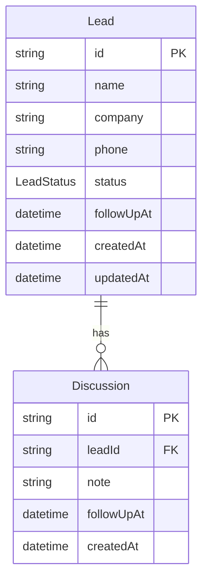

# LeadFlow — Architecture

This document is the implementation-focused reference: schema, API, backend and frontend architecture, caching, and core design decisions. The **[README](../README.md)** stays minimal on purpose.

---

## Contents

1. [System overview](#1-system-overview)
2. [Tech stack](#2-tech-stack)
3. [Repository layout](#3-repository-layout)
4. [Database schema](#4-database-schema)
5. [Backend architecture](#5-backend-architecture)
6. [API contract](#6-api-contract)
7. [Frontend architecture](#7-frontend-architecture)
8. [Docker & deployment notes](#8-docker--deployment-notes)
9. [Key design decisions](#9-key-design-decisions)

---

## 1. System overview

LeadFlow is a **single-screen lightweight CRM**: sales reps see all leads (with status, last note, relative activity time, follow-up cues), open one lead to see a **discussion timeline**, add notes with optional follow-up, and update status. **No routing** for the core experience and **no authentication** in scope.

Pinning **today’s follow-ups** and computing **last note** for the list use a single **SQL list query** (`$queryRaw`) with a lateral join and `CASE` ordering; adding a discussion with a follow-up uses a **Prisma transaction** so `leads.follow_up_at` stays consistent with the new row.

Requirements align with the sections below: single-screen CRM, follow-up ordering, timeline, search/filters, HTTP contract, and cache invalidation rules.

---

## 2. Tech stack

Stack choices and rationale. Where this repo differs from a generic template, **Implementation** notes the actual dependency.

### Backend

| Layer | Choice | Rationale |
|------|--------|------------|
| Runtime | Node.js 20 LTS | Stable, universal |
| Framework | Express | Minimal HTTP layer (**Express 5** was considered; **this repo uses Express 4** — see `backend/package.json`) |
| Database | PostgreSQL 16 | Relational integrity, `timestamptz`, ordering |
| ORM | Prisma | Schema as source of truth, migrations, transactions |
| Validation | Zod | Request validation + TS inference |
| Auth | Skipped | Per spec |

### Frontend

| Layer | Choice | Rationale |
|------|--------|------------|
| Framework | React 18 | List + detail + forms |
| Build | Vite | Fast HMR |
| UI | Radix primitives + Tailwind | Accessible dialogs/dropdowns; patterns align with common shadcn-style composition — components live under `frontend/src/components` |
| UI state | Zustand | Selected lead, filters, ephemeral UI |
| Server state | TanStack Query v5 | Cache, invalidation, loading/error |
| HTTP | Axios | Interceptors, errors |
| Styling | Tailwind CSS | Utility-first |
| Dates | date-fns | Formatting and relative time |
| Icons | Lucide React | Consistent set |

### Infrastructure

| Concern | Choice |
|---------|--------|
| Containers | Docker Compose (`docker-compose.yml`) |
| Migrations | Prisma Migrate |
| Seed | `backend/prisma/seed.ts` (see `package.json` `prisma.seed`) |

---

## 3. Repository layout

An ideal tree might use `routes/`, `services/`, `api/` folders. This repository follows the **same layering** with small path differences:

```
LeadFlow/
├── docker-compose.yml
├── .env.example
├── README.md
├── docs/
│   └── ARCHITECTURE.md          ← this file
├── backend/
│   ├── prisma/
│   │   ├── schema.prisma
│   │   ├── seed.ts
│   │   └── migrations/
│   └── src/
│       ├── index.ts
│       ├── routes/              → leads, discussions
│       ├── services/
│       ├── schemas/
│       ├── middleware/
│       └── utils/
└── frontend/
    └── src/
        ├── App.tsx
        ├── lib/api.ts           → Axios + leads/discussions helpers
        ├── store/useStore.ts    → Zustand (selection, filters, search)
        ├── hooks/               → useLeads, useDiscussions, useDebounce
        └── components/          → Lead list, detail, dialogs, badges
```

---

## 4. Database schema

Source of truth: **`backend/prisma/schema.prisma`** (see comments and fields below).

### Models (conceptual)

- **`Lead`** — `id`, `name`, `company`, `phone`, `status` (`LeadStatus` enum), **`followUpAt`** (denormalized “current” follow-up for fast list queries), `createdAt`, `updatedAt` (`@updatedAt`).
- **`Discussion`** — `id`, `leadId`, `note`, **`followUpAt`** (per-note audit), `createdAt`; **cascade delete** when a lead is removed.

### ER diagram (Mermaid)



### Invariants

- **`Lead.followUpAt`** is updated in the same **transaction** as inserting a **Discussion** when the client sends a follow-up on that note (discussions service).
- List query exposes **`lastNote` / `lastNoteAt`** via a **lateral join** to the latest discussion only (see **§5**).

---

## 5. Backend architecture

### Bootstrap

Express loads **CORS**, **JSON**, logging, mounts **`/api/leads`** and nested **`/api/leads/:leadId/discussions`**, then a **global error handler** (must be last). Validators use **Zod** via shared middleware.

### Routes → services

Handlers stay thin: validate → call service → return JSON with correct status. No separate controller layer for two resources.

### Leads `list()`

- **`$queryRaw`** selects explicit columns (including camelCase aliases for JSON where used).
- **Lateral join** picks the latest discussion for **`lastNote`** / **`lastNoteAt`**.
- **`ORDER BY`** uses `CASE` so rows with **`follow_up_at::date = CURRENT_DATE`** sort first, then by time, then **`updated_at`**. This is the **only raw SQL** in the project; it exists because Prisma’s `orderBy` cannot express that `CASE` in one place.

### Discussions `create()`

- **`$transaction`**: create **Discussion**; if **`followUpAt`** is present, update **`Lead.followUpAt`** in the same transaction.

### Errors

- **`AppError`** → status + `{ error: { message } }`.
- **Zod** → `400` with `fields` when applicable (consistent error shape across handlers).

---

## 6. API contract

HTTP contract summary. Paths are relative to the API base (e.g. `http://localhost:5001/api`).

### Leads

| Method | Path | Body | Success |
|--------|------|------|--------|
| GET | `/leads` | — | 200 |
| GET | `/leads?status=New` | — | 200 |
| GET | `/leads?search=john` | — | 200 |
| GET | `/leads?status=New&search=john` | — | 200 |
| POST | `/leads` | `{ name, company?, phone?, status? }` | 201 |
| PATCH | `/leads/:id` | `{ name?, company?, phone?, status?, followUpAt? }` | 200 |
| DELETE | `/leads/:id` | — | 204 |

### Discussions

| Method | Path | Body | Success |
|--------|------|------|--------|
| GET | `/leads/:leadId/discussions` | — | 200 |
| POST | `/leads/:leadId/discussions` | `{ note, followUpAt? }` | 201 |

### Lead list row shape (conceptual)

Includes lead fields plus **`lastNote`**, **`lastNoteAt`** (ISO strings or null) from the lateral join.

### HTTP status usage

| Scenario | Code |
|----------|------|
| Read OK | 200 |
| Created | 201 |
| Delete OK | 204 |
| Validation | 400 |
| Not found | 404 |
| Server error | 500 |

---

## 7. Frontend architecture

Patterns match the hooks and invalidation rules described below.

### Data flow

```
Axios (lib/api.ts)
  → TanStack Query hooks (hooks/useLeads.ts, useDiscussions.ts)
  → Components
  ← Zustand (store/useStore.ts) — selection, search, status filter only
```

Components should not embed business rules that belong on the server; mutations invalidate query keys as described in the TanStack Query setup.

### Query keys (concept)

- Leads list: scoped by **status** + **search** (see `useLeads` + `leadKeys`).
- Discussions: **`['discussions', leadId]`** (or equivalent) per lead.

### Optimistic updates

Optimistic UI is used for **discussion submit** (timeline feels instant); other mutations may rely on invalidation alone.

### UX responsibilities

- **Empty / loading / error** surfaces for list and timeline.
- **Accessibility**: labels, focus, Radix defaults where used.
- **Follow-up urgency**: list UI derives “today” / “overdue” from **`followUpAt`** and dates.

---

## 8. Docker & deployment notes

**Current `docker-compose.yml`** runs **Postgres**, **backend**, and **frontend** with dev-oriented bind mounts; it does **not** automatically run `prisma migrate deploy` + seed on container start (see **README** — run migrate/seed from `backend/` after first up).

An alternative production-style setup uses **nginx** serving static assets and proxying **`/api`** to the backend so the browser uses same-origin `/api`. That pattern is optional and not required for local Compose in this repo.

---

## 9. Key design decisions

These summarize the main technical choices for reviewers.

### Why Prisma (vs Drizzle)

Readable schema, first-class migrations, **`$transaction`**, and **`@updatedAt`** without triggers. Prisma was chosen for clarity and relational ergonomics.

### Why one `$queryRaw` for the leads list

Pinning “today” and attaching **last note** need **SQL ordering** and a **lateral** subquery that Prisma’s fluent API does not express in one shot. A single raw query keeps ordering correct in the database instead of re-sorting in JS.

### Why a transaction on discussion create

If **`followUpAt`** updates **`Lead`** and inserts **`Discussion`**, both must commit together or rollback together so the list and timeline never disagree.

### Why Zustand + TanStack Query

**Zustand** holds **UI state** (what is selected, what filters are on). **TanStack Query** holds **server state** (fetch, cache, invalidation). Mixing the two avoids stale API data in a global store or UI concerns inside the cache.

### Why optimistic updates where they are

Discussion submit is the highest-frequency, most visible interaction; instant feedback there has the best UX ROI. Other mutations can tolerate a short pending state.

### UI stack note

Some stacks use **shadcn/ui** and **Sonner** toasts; this codebase uses **Radix + Tailwind** directly and **inline** patterns — behavior matches the intended interaction model even if package names differ.

---

## References

- **[README.md](../README.md)** — quick start and env vars only.
